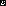
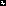

# TransitIQ: AI-Powered Traffic Flow Optimization

TransitIQ is a smart traffic management system that leverages computer vision and artificial intelligence to optimize traffic flow at intersections. Using a combination of YOLOv8 object detection and ArUco marker-based region mapping, the system provides real-time vehicle detection and counting in designated intersection zones, enabling dynamic traffic signal control for improved urban mobility.

## Features

- **Advanced Vehicle Detection:** Utilizes YOLOv8 neural network (yolov8n.pt) for accurate, real-time vehicle detection
- **ArUco Marker Integration:** Employs ArUco markers for precise traffic zone mapping and calibration
- **Multi-Region Analysis:** Segments intersection into distinct zones (North, South, East, West) for granular traffic monitoring
- **Real-time Processing:** Provides immediate vehicle detection and counting with visual feedback
- **Arduino Integration:** Communicates traffic data to Arduino-based signal controllers via serial protocol
- **Visual Debugging:** Displays detection boxes, region markers, and traffic statistics in real-time

## Directory Structure

```
transitiq/
├── ai_processing/
│   ├── dependencies/
│   │   ├── coco.names                        # COCO dataset class names
│   │   ├── yolov3.cfg                        # YOLOv3 configuration
│   │   └── yolov3.weights                    # YOLOv3 model weights
│   ├── yolov8n.pt                           # YOLOv8 nano model weights
│   ├── traffic_markers.py                    # Traffic analysis w/ aruco markers
│   ├── traffic_masking.py                    # Traffic analysis w/ coloured masking
│   └── requirements.txt                      # Python dependencies
├── arduino_control/
│   └── traffic_controller/
│       ├── traffic_controller.ino            # Arduino signal control logic
│       └── keywords.txt                      # Arduino IDE syntax config
├── documentation/
│   ├── aruco_mappings.md                    # ArUco marker specifications
│   ├── pin_mappings.md                      # Arduino GPIO configurations
│   ├── protocol_spec.md                      # Serial protocol documentation
│   └── documentation/aruco_markers/                       # Generated ArUco markers
│       └── M[0-15].svg                      # Individual marker files
└── test_assets/
    ├── Mask.png                             # Region masking template
    ├── Traffic.png                           # Sample traffic image
    ├── Traffic_Markers.jpg                   # Test image with markers
    └── Traffic_Markers.png                   # Additional test image
```

## Technical Components

### AI Processing Module

- **Vehicle Detection:** Implements YOLOv8 nano model for efficient object detection
- **Region Analysis:** Uses ArUco markers to define and track traffic zones
- **Traffic Analytics:** Provides real-time vehicle counting and zone occupancy data
- **Serial Communication:** Implements checksum-verified data packets for reliable Arduino communication

### Arduino Control System

- **Signal Management:** Controls traffic light timing based on AI-processed data
- **Communication Protocol:** Uses 115200 baud rate serial connection with error checking
- **LED Matrix:** Manages multiple traffic signal displays through GPIO pins

## Installation

1. **Clone the repository:**
   ```bash
   git clone https://github.com/AbhinavBaiju/TransitIQ.git
   cd TransitIQ
   ```

2. **Set up Python virtual environment:**
   ```bash
   python -m venv venv
   ```

3. **Activate the virtual environment:**
   ```bash
   # On Windows:
   .\venv\Scripts\activate
   
   # On macOS/Linux:
   source venv/bin/activate
   ```

4. **Install Python dependencies:**
   ```bash
   cd ai_processing
   pip install -r requirements.txt
   ```

5. **Run the traffic analysis script:**
   ```bash
   python traffic_markers.py
   ```

6. **Arduino Setup:**
   - Open `arduino_control/traffic_controller/traffic_controller.ino` in Arduino IDE
   - Install required Arduino libraries through Library Manager
   - Upload the code to your Arduino board

## Usage

1. **Prepare the intersection setup:**
   - Print and place ArUco markers (found in `documentation/aruco_markers/`)
   - Connect the Arduino controller according to `documentation/pin_mappings.md`
   - Position the camera to capture all markers and traffic lanes

2. **Configure the system:**
   - Verify serial port settings in `traffic_markers.py`
   - Adjust detection parameters if needed

3. **Run the traffic analysis:**
   ```bash
   cd ai_processing
   python traffic_markers.py
   ```

4. **Monitor the output:**
   - View real-time detection window showing vehicle tracking
   - Check console for zone-wise vehicle counts
   - Verify Arduino receiving and processing traffic data

## Contributing

Contributions are welcome! Please read our contribution guidelines before submitting pull requests.

## License

This project is licensed under the MIT License - see the [LICENSE](LICENSE) file for details.

## Acknowledgements

- [Ultralytics](https://github.com/ultralytics/ultralytics) for YOLOv8
- [OpenCV](https://opencv.org/) for computer vision capabilities
- [ArUco](https://docs.opencv.org/master/d5/dae/tutorial_aruco_detection.html) for marker detection

## Project Team

- Muhammad Afsah Mumtaz
- Abhinav Baiju
- Chetana Venkatesh
- Ujwal Kumar Reddy
- Aman Rakesh Krishnan

## Contact

For questions, issues, or collaboration opportunities, please open an issue on GitHub or contact the project maintainers.

## Lane Analysis Methods

### Marker-Based Analysis
The system employs ArUco markers for precise traffic zone definition and analysis. These markers serve as reference points to map and track distinct traffic zones at intersections.


*ArUco markers define distinct traffic zones for vehicle detection and counting*

## Lane Marker IDs

| Direction | Marker IDs | Marker Images |
|-----------|------------|---------------|
| North | 0, 1, 2, 3 |     |
| South | 4, 5, 6, 7 |     |
| East | 8, 9, 10, 11 |     |
| West | 12, 13, 14, 15 |     |

### Masking-Based Analysis
In addition to marker-based analysis, the system supports region masking for defining specific areas of interest. This approach allows for flexible zone definition through mask templates.


*Mask template defining traffic analysis zones*


*Real-time traffic monitoring with defined analysis zones*
